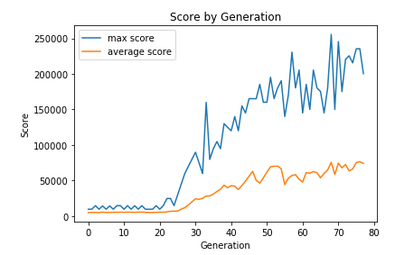
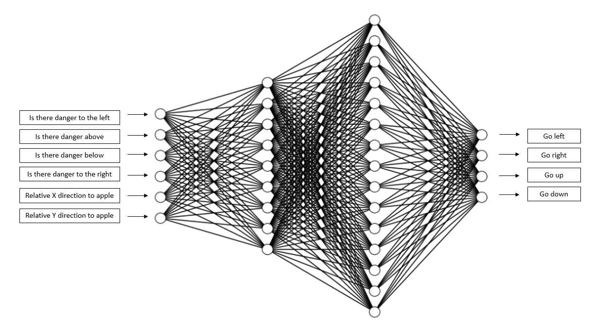

# Snake_AI  
## Deep Q Learning  
My first attempt to create a snake AI was by using deep q learning. Unfortunately, this method did not work. While the snake was trained to go to the appropriate X coordinate or the appropriate Y coordinate it could never learn them both. I tried to change my hyper-parameters by adjusting the learning rate or the discount rate. This cause the neural network to converge to one output regardless of what input I gave. I still have the deep q learning code in snake_ai_DQN.py and dqn_agent.py if you want to take a look at that.  

## Genetic Algorithm  
### Overview
The more successful approach I had was with the genetic algorithm. How the genetic algorithm worked is as follows. Initially, we create 1 generation of snakes (50 snakes in 1 generation) each with randomly generated weights within its neural network. Out of the generation, we select 12 snakes with highest scores and use those snakes to reproduce 50 more snakes for the next generation. Each snake is generated by selecting 2 of the 12 snakes (the parent snakes) and mixing and matching the neural network weights from each parent snake. Just like in real life however, there is a chance for a mutation to occur. How a mutation works is that for each snake, we randomly pick 25 weights from its neural network and add it by a random decimal ranging from -1 to 1. The idea is that these mutations will make some snakes smarter and score higher which will enable them to pass on their weights to the next generation.  

### Libraries  
There are many tools that I used to create the snake AI using the genetic algorithm. I used pygame for the graphics so the user will be able to see what the snake is doing and the patterns the snake is learning. I have also used numpy to help speed up a lot of the mathematical operations involving the neural network. I compiled the computationally heavy functions using numba so it can avoid going through the python interpreter. Using numba vastly improved the computational speed of my program. I also used a lot of smaller python libraries like random and math.  

### Visualizations  
These visualizations are meant to help you understand the neural network architecture and the AI's progression over time.  

A visual representation of how each generation of snakes perform. As you can see the max scores tend to have a lot of fluctuation. This is because either that particular mutation was very helpful in increasing the snakes intelligence or we got lucky and the apples happened to be in easy to reach locations. The average scores on the other hand tend to have a lot less fluctuation and it gives us a better understanding of how well our AI is performing.  
  

This diagram illustrates how our neural network is structured. As we can see, the neural network takes 6 inputs. The first 4 nodes are binary to tell us whether or not the snake will die if it makes one step in that direction. The last 2 nodes tell us where the apple is relative to the snake. The values can be either -1, 0, or 1. A value of -1 indicates the apple is to the left or above the snakes head depending on the node. A value of 0 indicates that the snakes head is at the right x or y coordinate of the apple. A value of 1 indicates the apple is to the right or below the snakes head depending on the node. The outputs are straightforward. We have 4 outputs each one representing the direction the snake can go.  
  
